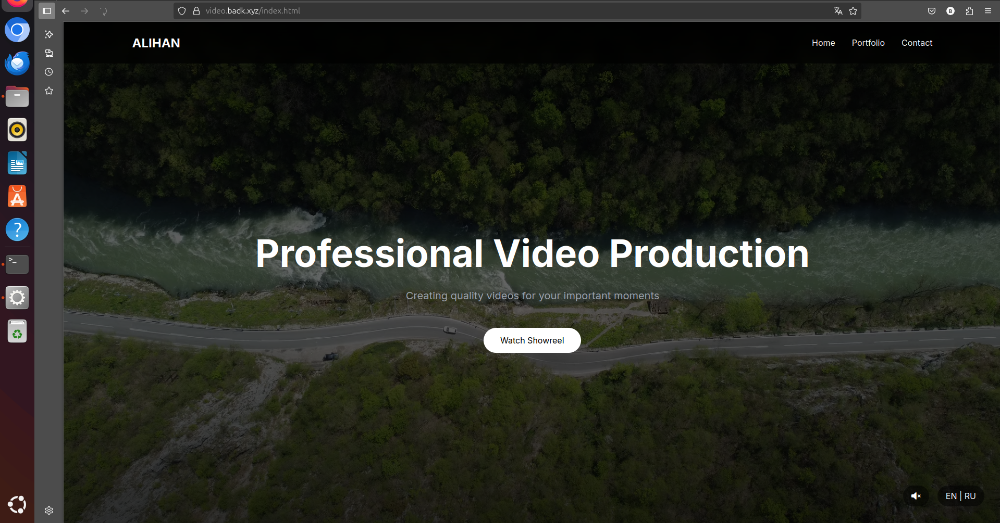
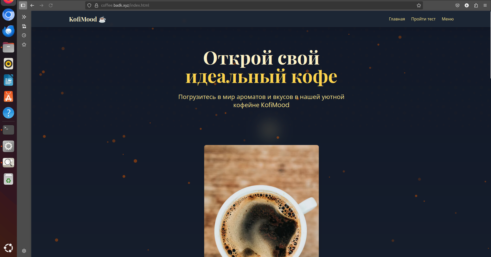

# sitesmain
# My 6 Handsome Sites

These are my 6 handsome sites (they are boys), published on the Internet.  
Static sites mostly, plus I have 2 more Django projects (check my profile).  

All of them are scaled on VPS, domain name cost only 1 dollar (I found it cheap).  
they use 3rd level domains mostly, with one on 2nd level.  
Example of fast development — all these were done in 1 day each, and they are live now with ssl.

---
### 1. Videomaker (for example Alihan, like my cat)  
[https://video.badk.xyz](https://video.badk.xyz)  
Interesting music and video design, good (for Bishkek) videomaker site.  
Music initialized from JS.  
I like this design — it looks official and it was the start of my site projects.

---

### 2. Bookshop (old stuff, we already have Amazon and Litres in Russia)  
[https://book.badk.xyz/](https://book.badk.xyz/)  
Simple shopping cart implemented with browser session id.  
I really don’t like the general idea — like a book shop, (we are already buying online and desktop books) that was a college diploma project I made for one student.

---

### 3. KofiMood (Coffee mood)  
[https://coffee.badk.xyz/](https://coffee.badk.xyz/)  
Example of a coffee-shop landing page with tests and coffee choosing.  
Simple site, with 2 themes.

---

### 4. IT Courses site  
[https://it.badk.xyz/](https://it.badk.xyz/)  
Also a simple site with great design, it was a diploma project too.

---

### 5. Kyrgyzstan Ecology 
[https://badk.xyz/](https://badk.xyz/)  
Kyrgyz volunteers and activists site which may help solve part of communication problems.  
(I don’t even know if there’s a real organization or site — it’s a problem of our country, of course.)

---

### 6. Noir Studio  
I like this design — black and white, professional studio inspired by DJI site (I love their site) ).
[https://noir.badk.xyz/](https://noir.badk.xyz/)

All these sites were developed in 1 day each and are currently running on the server with SSL included.  
They are examples of my different tasks and skills in life (diploma I love you).

Feel free to check them and give feedback (or not feel))

RUSSIAN. Русский.

# Мои 6 Крутых Сайтов

Это мои 6 крутых сайтов (они — мои «парни»), опубликованных в интернете.  
В основном это статические сайты, ещё есть 2 проекта на Django (смотри в моём профиле).  

Все они развернуты на VPS, домен куплен за 1 доллар (нашёл очень дешево).  
Используются домены третьего уровня, один — второго.  
Пример быстрой разработки — каждый из этих сайтов делался за 1 день и сейчас работает с SSL.

---

### 1. Видеомейкер (например, Алихан — как мой кот)  
[https://video.badk.xyz](https://video.badk.xyz)  
Интересный дизайн с музыкой и видео, хороший сайт видеомейкера (для Бишкека).  
Музыка запускается через JS.  
Мне нравится этот дизайн — выглядит официально и был началом моих проектов сайтов.

---

### 2. Книжный магазин (старьё, у нас уже есть Амазон и Литрес в России)  
[https://book.badk.xyz/](https://book.badk.xyz/)  
Реализована простая корзина с использованием session id браузера.  
Мне не очень нравится сама идея книжного магазина — это был дипломный проект колледжа, который я делал для одного студента.

---

### 3. KofiMood (Настроение кофе)  
[https://coffee.badk.xyz/](https://coffee.badk.xyz/)  
Пример лендинг-страницы для кофейни с тестом и выбором кофе.  
Простой сайт с двумя темами.

---

### 4. Сайт IT курсов  
[https://it.badk.xyz/](https://it.badk.xyz/)  
Тоже простой сайт с классным дизайном, тоже дипломный проект.

---

### 5. Экология Кыргызстана  
Сайт кыргызских волонтёров и активистов, который может помочь решить часть проблем в коммуникации.  
(Честно говоря, я даже не уверен, есть ли реальная организация и подобные сайты — это проблема нашей страны, конечно.)

---

### 6. Noir Studio  
Мне нравится этот дизайн — чёрно-белый, профессиональный, вдохновлён сайтом DJI (я их сайт тоже люблю).

---

Все эти сайты сделаны за 1 день каждый и сейчас работают на сервере с включённым SSL.  
Это примеры моих разных задач и навыков в жизни.

---

Заходите, смотрите, пишите отзывы!

---

## Другие проекты

В моём профиле есть ещё 2 проекта на Django с более сложным функционалом.

---

*Домены дешёвые, но надёжные — можно быстро и недорого масштабироваться.*
